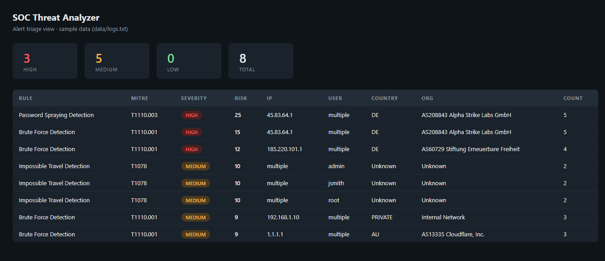

# SOC Threat Analyzer

A Python detection pipeline that identifies authentication-based attacks, enriches alerts with threat intelligence, and prioritizes incidents using risk scoring mapped to MITRE ATT&CK.

The same detection logic drives fraud monitoring in the card business: impossible travel, velocity checks and pattern-based alerting are core techniques in both worlds. I spent two years doing exactly this kind of triage in 24/7 fraud detection at a Swiss payment services provider - this project rebuilds the craft in code.


> I built this project while studying for CompTIA Security+ and working through
> TryHackMe SOC Level 1. My goal was to implement real detection workflows in
> code - detection, enrichment and triage - rather than just reading about them.
> I learn best hands-on.



## Scenario

This project simulates an environment where authentication log analysis is used to detect active attack patterns. The pipeline mirrors real triage workflows:

```
Ingest -> Parse -> Detect -> Enrich -> Score -> Alert
```

## Detection Rules (SIGMA-based)

All rules are defined as functional SIGMA-style dicts in `src/detector.py`. Thresholds and time windows are driven by `config/settings.py` - no hardcoded values.

| Rule ID | Rule | MITRE Technique | Trigger |
|---------|------|-----------------|---------|
| bf-001 | Brute Force Detection | T1110.001 - Password Guessing | ≥3 failed logins from one IP within 5 min |
| ps-001 | Password Spraying Detection | T1110.003 - Password Spraying | ≥3 distinct users targeted from one IP within 10 min |
| it-001 | Impossible Travel Detection | T1078 - Valid Accounts | Same user from ≥2 distinct IPs within 5 min |

## Example Output

Running `soc-analyze` against the sample logs produces 8 alerts across all three rules:

```text
$ soc-analyze

[bf-001] Brute force from 185.220.101.1 (4 attempts)
[bf-001] Brute force from 192.168.1.10 (3 attempts)
[bf-001] Brute force from 1.1.1.1 (3 attempts)
[bf-001] Brute force from 45.83.64.1 (5 attempts)
[ps-001] Password spraying from 45.83.64.1 targeting ['admin', 'guest', 'operator', 'root', 'test']
[it-001] Impossible travel for 'admin' across ['1.1.1.1', '192.168.1.10']
[it-001] Impossible travel for 'jsmith' across ['103.21.244.0', '185.220.101.1']
[it-001] Impossible travel for 'root' across ['45.83.64.1', '8.8.8.8']

Total alerts after deduplication: 8
```

**Sample enriched alert (JSON):**

```json
{
  "rule_id": "bf-001",
  "rule": "Brute Force Detection",
  "mitre": "T1110.001",
  "sigma_severity": "high",
  "ip": "185.220.101.1",
  "user": "multiple",
  "count": 4,
  "country": "DE",
  "org": "AS60729 Stiftung Erneuerbare Freiheit",
  "risk_score": 12,
  "severity": "HIGH"
}
```

## Architecture

```
log file(s) / directory
       │
       ▼
parser.py       -> parses log entries, skips malformed lines
       │
       ▼
detector.py     -> runs all SIGMA rules, deduplicates alerts
   ├─ bf-001    Brute Force       (T1110.001)
   ├─ ps-001    Password Spraying (T1110.003)
   └─ it-001    Impossible Travel (T1078)
       │
       ▼
threat_intel.py -> ipinfo.io enrichment with in-memory cache
                   private IP detection (RFC 1918)
       │
       ▼
risk_scoring.py -> calculates risk score, severity, MITRE label
       │
       ▼
main.py         -> prints alerts + exports to output/alerts.csv
dashboard.py    -> Flask REST API
```

## Risk Scoring

| Factor | Points |
|--------|--------|
| Each login event counted for the alert | +3 |
| Suspicious country (RU, CN, KP) | +5 |
| Tor exit node detected in org | +5 |
| Each distinct user targeted (spraying) | +2 |
| Each distinct IP (impossible travel) | +2 |

| Score | Severity |
|-------|----------|
| 0–5 | LOW |
| 6–11 | MEDIUM |
| 12+ | HIGH |

## Features

- Log parsing with per-line error handling and skip-logging
- Three functional SIGMA-based detection rules
- Alert deduplication across detection passes
- Single file, directory, or recursive folder ingestion
- Multi-file cross-file correlation - impossible travel and spraying detected across host boundaries
- Runtime threshold overrides via CLI flags or dashboard query params - no config file editing required
- CSV export with configurable output path, skippable via `--no-export`
- IP enrichment via ipinfo.io with in-memory caching and optional token support
- Private IP detection (RFC 1918) - no wasted API calls
- MITRE ATT&CK sub-technique mapping
- Flask REST dashboard with single and multi-file upload
- Structured logging via Python `logging` module
- 118 tests across 7 focused modules, 93% coverage

## Technologies

- Python 3.10+
- Flask (REST dashboard)
- requests + ipinfo.io (threat intelligence)
- pytest + pytest-cov (testing)
- MITRE ATT&CK (T1110.001, T1110.003, T1078)
- SIGMA rule format

## Project Structure

```
soc_threat_analyzer/
├── config/
│   └── settings.py             # single source of truth for all thresholds
├── data/
│   ├── logs.txt                # sample authentication logs
│   └── ips.txt                 # sample IP list
├── src/
│   ├── main.py                 # pipeline, folder/file ingestion, CLI, CSV export
│   ├── parser.py               # log file parser
│   ├── detector.py             # SIGMA rules + detection logic
│   ├── threat_intel.py         # ipinfo.io enrichment with caching + token support
│   ├── risk_scoring.py         # scoring + severity + MITRE mapping
│   └── dashboard.py            # Flask REST API with upload endpoint
├── tests/
│   ├── conftest.py             # shared pytest fixtures
│   ├── test_detector.py        # brute force, spraying, impossible travel, deduplication
│   ├── test_scoring.py         # risk scoring, severity, MITRE mapping
│   ├── test_parser.py          # log parsing and error handling
│   ├── test_threat_intel.py    # private IP detection, get_ip_info, caching
│   ├── test_pipeline.py        # single file, multi-file, folder scan, CSV export
│   ├── test_dashboard.py       # all dashboard endpoints
│   └── test_main.py            # CLI arg parser, main() execution paths
├── output/                     # generated output (gitignored)
├── .env.example                # token configuration template
└── .gitignore
```

## How to Run

```bash
# Install
pip install -e .

# Analyze sample data (default)
soc-analyze
python -m src.main          # equivalent

# Analyze a custom log file
soc-analyze --logs /path/to/auth.log
python -m src.main --logs /path/to/auth.log             # equivalent

# Analyze all .log/.txt files in a directory
soc-analyze --logs-dir /path/to/logs/

# Analyze recursively (includes subdirectories)
soc-analyze --logs-dir /path/to/logs/ --recursive

# Override detection thresholds at runtime
soc-analyze --logs /path/to/auth.log --threshold 2 --window 3
soc-analyze --logs-dir /path/to/logs/ --spray-threshold 2 --travel-threshold 2

# Custom output path
soc-analyze --logs /path/to/auth.log --output /path/to/results.csv

# Skip CSV export
soc-analyze --logs-dir /path/to/logs/ --no-export

# All options
soc-analyze --help
```

Flask dashboard:
```bash
python -m src.dashboard
# -> http://localhost:5000

# Alternative
flask --app src.dashboard run
```

Dashboard endpoints:
```
GET    /               Welcome + endpoint list + parameter docs
GET    /ui             Alert triage view (HTML)
GET    /alerts         Alerts from sample data (data/logs.txt)
GET    /alerts/summary Severity counts and rule breakdown
POST   /upload         Analyze one or more uploaded log files
DELETE /cache          Clear cached sample-data alerts
```

Upload examples:
```bash
# Single file
curl -X POST http://localhost:5000/upload -F "file=@auth.log"

# Multiple files (cross-file correlation applies)
curl -X POST http://localhost:5000/upload -F "file=@host1.log" -F "file=@host2.log"

# With threshold overrides
curl -X POST "http://localhost:5000/upload?threshold=2&window=3" -F "file=@auth.log"
```

Tests:
```bash
pip install -e ".[dev]"
pytest tests/ -v
```

## Configuration

Edit `config/settings.py` to tune detection behaviour - changes take effect on the next run, no reinstall required:

```python
THRESHOLD = 3            # brute force: failed login threshold
WINDOW_MINUTES = 5       # brute force: time window
SPRAY_THRESHOLD = 3      # spraying: distinct user threshold
SPRAY_WINDOW_MINUTES = 10
TRAVEL_THRESHOLD = 2     # impossible travel: distinct IP threshold
TRAVEL_WINDOW_MINUTES = 5
SUSPICIOUS_COUNTRIES = ["RU", "CN", "KP"]
SEVERITY_HIGH = 12
SEVERITY_MEDIUM = 6
```

All thresholds can also be overridden at runtime via CLI flags or dashboard query parameters without editing `settings.py`.

### IP Enrichment Token

ipinfo.io works without a token (50k requests/month free). To use your own token:

```bash
cp .env.example .env
# Edit .env: IPINFO_TOKEN=your_token_here
```

## Limitations

- Uses public ipinfo.io API (no enterprise threat feed)
- Simulated log data (no real production logs)
- In-memory cache resets on restart

## Future Improvements

- SIEM integration (Splunk / ELK)
- Real-time log ingestion (file watcher)
- AbuseIPDB or VirusTotal enrichment
- Persistent cache (Redis)
- Dashboard visualization (charts)

## Disclaimer

This project is for educational purposes and simulates SOC workflows using synthetic data.
